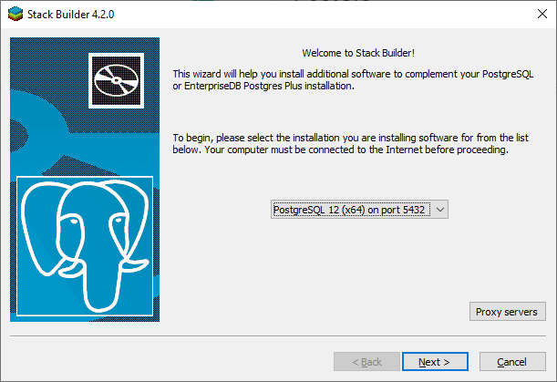
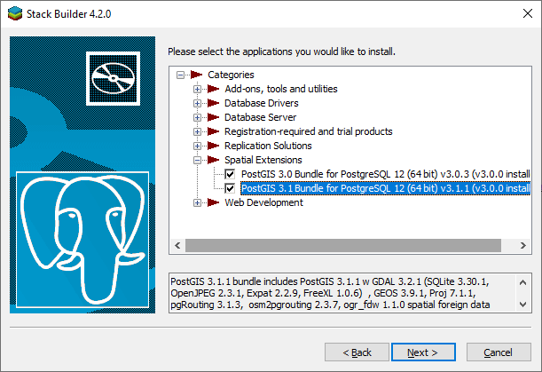
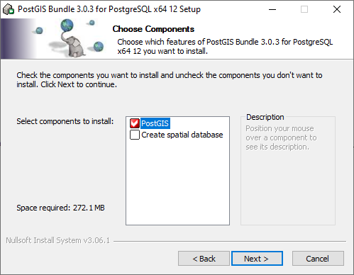

# Spatial Database/PostGIS

A spatial database is a database that is optimized for storing and querying data that represents objects defined in a geometric space. Most spatial databases allow the representation of simple geometric objects such as points, lines and polygons. Some spatial databases handle more complex structures such as 3D objects, topological coverages, linear networks, etc. 

The Open Geospatial Consortium (OGC) developed the Simple Features specification (first released in 1997) and sets standards for adding spatial functionality to database systems. The SQL/MM Spatial ISO/IEC standard is a part the SQL/MM multimedia standard and extends the Simple Features standard with data types that support circular interpolations.

## Spatial database managment systems
There are many database engines of this type. You can give examples as an example:

- GeoMesa 
- H2 (H2GIS) 
- IBM DB2 (IBM Informix Geodetic and Spatial)
- Microsoft SQL Server
- MonetDB/GIS 
- MySQL DBMS 
- Neo4j 
- Oracle Spatial
- PostgreSQL DBMS (PostGIS)

## PostGIS

### Example data set
To complete these activities, you will need to download a sample set that describes New York [(data)](http://s3.cleverelephant.ca/postgis-workshop-2018.zip).

This collection contains publicly available information on:
- blocks
- districts
- streets
- underground
- population data.

### Instalation PostGIS in PostgreSQL server

1. Open *PostgreSQL Application Stack Builder*.

2. The select server where you want to install PostGIS.
3. 


3. In section *Spatial Extensions* select PostGIS version to install.
4. 


4. Select a path to download installation file.

5. Before install PostGIS close PgAdmin.

6. Install PostGIS.
	1. Confirm licens:
	
	
	
	2. Install only PostGIS
	
	
### Create Spatial Database

1. Run PgAdmin

2. Create Database with settings:
	- Database: lab10_nyc
	- Owner: your admin user
	
3. Open *Query Tool* for  lab10_nyc

4. Add spatial extension to this database using the query:
```sql
CREATE EXTENSION postgis;
```
5. Confirm that PostGIS is installed by running a PostGIS function:

```sql
SELECT postgis_full_version();
```

Expected result:
```
POSTGIS="3.1.1 3.1.1" [EXTENSION] PGSQL="120" GEOS="3.9.1-CAPI-1.14.1" PROJ="7.1.1" LIBXML="2.9.9" LIBJSON="0.12" LIBPROTOBUF="1.2.1" WAGYU="0.5.0 (Internal)"
```

### Import spatial data to database

1. Open application *PostGIS Shapefile Import/Export Manager*


2. Inicializ conection to lab10_nyc using *View connection details...*
3. *Add File* from download [data](http://s3.cleverelephant.ca/postgis-workshop-2018.zip) with extension shp.
A shapefile (shp) is a simple, nontopological format for storing the geometric location and attribute information of geographic features. Geographic features in a shapefile can be represented by points, lines, or polygons (areas). The workspace containing shapefiles may also contain dBASE tables, which can store additional attributes that can be joined to a shapefile's features.
Mandatory files:

 - .shp—shape format; the feature geometry,
- .shx—shape index format; a positional index of the feature geometry
- .dbf—attribute format; columnar attributes for each shape, in dBase III 

Optional files include:

- .prj—projection format; the coordinate system and projection information, a plain text file describing the projection using well-known text format

4. Set data like in the image:


5. *Import* data to the database.
6. Check the result in PgAdmin


## View geometric data

### QGIS

QGIS is an Open Source Geographic Information System. The project was born in May 2002 and was established as a project on SourceForge in June the same year. We have worked hard to make GIS software (which is traditionally expensive proprietary software) available to anyone with access to a personal computer. QGIS currently runs on most Unix platforms, Windows, and macOS. QGIS is developed using the Qt toolkit (https://www.qt.io) and C++. This means that QGIS feels snappy and has a pleasing, easy-to-use graphical user interface (GUI).

QGIS aims to be a user-friendly GIS, providing common functions and features. The initial goal of the project was to provide a GIS data viewer. QGIS has reached the point in its evolution where it is being used for daily GIS data-viewing needs, for data capture, for advanced GIS analysis, and for presentations in the form of sophisticated maps, atlases and reports. QGIS supports a wealth of raster and vector data formats, with new format support easily added using the plugin architecture.

#### Connection with PostGIS database

1. Open QGIS.
2. In section *Explore* click second mouse botton on the PostGIS.
3. Add new connection setting form on the way on the image.
4. 


4. After connection open PostGIS database layer in QGIS.


## Create table with geometry columns 

The PostGis support two standard ways of expressing spatial objects: 
	- the Well-Known Text (WKT) form 
	- the Well-Known Binary (WKB) form. 
	
Both WKT and WKB include information about the type of the object and the coordinates which form the object.

Examples of the selected text representations of the spatial objects (WKT ) of the features are as follows:

	- POINT(0 0) - describe point in 2D space
 
	- POINT Z (0 0 0) - describe point in 3D space

	- POINT ZM (0 0 0 0) - describe point in 4D space

	- LINESTRING(0 0,1 1,1 2) - describe line in 2D space

	- POLYGON((0 0,4 0,4 4,0 4,0 0),(1 1, 2 1, 2 2, 1 2,1 1)) - describe poligon in 2D

	- MULTIPOINT((0 0),(1 2)) - describe set of points in 2D space

	- MULTIPOINT Z ((0 0 0),(1 2 3)) - describe set of points in 3D space

	- MULTILINESTRING((0 0,1 1,1 2),(2 3,3 2,5 4)) - describe set of lines in 2D space

	- MULTIPOLYGON(((0 0,4 0,4 4,0 4,0 0),(1 1,2 1,2 2,1 2,1 1)), ((-1 -1,-1 -2,-2 -2,-2 -1,-1 -1))) - describe set of polygons in 2D space

	- GEOMETRYCOLLECTION(POINT(2 3),LINESTRING(2 3,3 4)) - describe set of geometry object

In practice we can use this information to create simply table with geometry columns:
	
1. In pgAdmin, open database **lab10_nyc** and run SQL Editor.	
2. Create table geom_example:
```sql 
CREATE TABLE geom_example (object_name varchar, geom geometry);
```
3. Because the creation of geometric objects is done by giving the constructor in text form. The commands for adding objects to table will take the form:
```sql
INSERT INTO geom_example VALUES
	('Point', 'POINT(0 0)'),
	('Linestring', 'LINESTRING(0 0, 1 1, 2 1, 2 2)'),
	('Polygon', 'POLYGON((0 0, 1 0, 1 1, 0 1, 0 0))'),
	('PolygonWithHole', 'POLYGON((0 0, 10 0, 10 10, 0 10, 0 0),(1 1, 1 2, 2 2, 2 1, 1 1))'),
	('Collection', 'GEOMETRYCOLLECTION(POINT(2 0),POLYGON((0 0, 1 0, 1 1, 0 1, 0 0)))');
```

4. To check the definition of graphical objects in the database, we can use the function *ST_AsText*:
```sql
SELECT object_name, ST_AsText(geom) FROM geom_example;
```
	
## Spatial function
Using geometric objects in the spatial database is done by manipulating them with the functions built into the database. We should remember that with  PostGIS all functions assume the geometric type, but their operation differs depending on the represented object. Of course, this principle does not apply to other database engines of this type.

In this section, selected functions will be discussed along with their subcategories.

### Input/Output data 
- **ST_GeomFromText(text)** - returns geometry,
- **ST_AsText(geometry)** - returns WKT text,
- **ST_AsEWKT(geometry)** - returns EWKT text,
- **ST_GeomFromWKB(bytea)** - returns geometry,
- **ST_AsBinary(geometry)** - returns WKB bytea,
- **ST_AsEWKB(geometry)** - returns EWKB bytea,
- **ST_GeomFromGML(text)** - returns geometry,
- **ST_AsGML(geometry)** - returns GML text,
- **ST_GeomFromKML(text)** - returns geometry,
- **ST_AsKML(geometry)** - returns KML text,
- **ST_AsGeoJSON(geometry)** - returns JSON text,
- **ST_AsSVG(geometry)** - returns SVG text,

### Data type exploration

- **ST_GeometryType(geometry)** -  returns the type of the geometry,
- **ST_NDims(geometry)** - returns the number of dimensions of the geometry,
- **ST_NumGeometries(geometry)** - returns the number of parts in the collection,
- **ST_GeometryN(geometry,int)** - returns the specified part of the collection,
- **ST_NumGeometries(multi/geomcollection)** - returns the number of parts in the collection

### Geometry description
- **ST_X(geometry)** - returns the X coordinate of point,
- **ST_Y(geometry)** - returns the Y coordinate of point,
- **ST_StartPoint(geometry)** - returns the first line string coordinate as a point,
- **ST_EndPoint(geometry)** - returns the last line string coordinate as a point,
- **ST_NPoints(geometry)** - returns the number of coordinates in the line string,
- **ST_Length(geometry)** - returns the total length of all linear parts,
- **ST_Area(geometry)** - returns the total area of all polygonal parts,
- **ST_NRings(geometry)** - returns the number of rings (usually 1, more if there are holes) of polygonal,
- **ST_ExteriorRing(geometry)** - returns the outer ring as a line string of polygonal,
- **ST_InteriorRingN(geometry,n)** - returns a specified interior ring as a line string of polygonal,
- **ST_Perimeter(geometry)** - returns the length of all the rings of polygonal,

### Geometry relation
- **ST_Contains(geometry A, geometry B)** - returns true if geometry A contains geometry B
- **ST_Crosses(geometry A, geometry B)** - returns true if geometry A crosses geometry B
- **ST_Disjoint(geometry A , geometry B)** - returns true if the geometries do not “spatially intersect”
- **ST_Distance(geometry A, geometry B)** - returns the minimum distance between geometry A and geometry B
- **ST_DWithin(geometry A, geometry B, radius)** - returns true if geometry A is radius distance or less from geometry B
- **ST_Equals(geometry A, geometry B)** - returns true if geometry A is the same as geometry B
- **ST_Intersects(geometry A, geometry B)** - returns true if geometry A intersects geometry B
- **ST_Overlaps(geometry A, geometry B)** - returns true if geometry A and geometry B share space, but are not completely contained by each other.
- **ST_Touches(geometry A, geometry B)** - returns true if the boundary of geometry A touches geometry B
- **ST_Within(geometry A, geometry B)** - returns true if geometry A is within geometry B

##Exercises:

1. How many records are in the nyc_streets table?
2. How many streets in New York have names that start with ‘B’, 'Q' and 'M'?
3. What is the population of New York city?
4. What is the population of the Bronx, Manhattan and Queens?
5. How many "neighborhoods" are in each borough?
6. What is the area of the: West Village, Harlem, Great Kills neighborhood?
7. Find all neighborhoods bordering on: Rossville, Queens Village and Midtown
8. What is the area of: Staten Island, Manhattan, Brooklyn?
9. How many census blocks in New York City have a hole in them?
10. What is the summary area of 'a hole' of census blocks in New York City?
11. What is the length of streets in New York City, summarized by type?
12. What streets crossing  with: Pacific St, E 9th St, Avenue K?
13. Find ten closest stations from: Elder Ave, Castle Hill Ave, 4th Ave.
