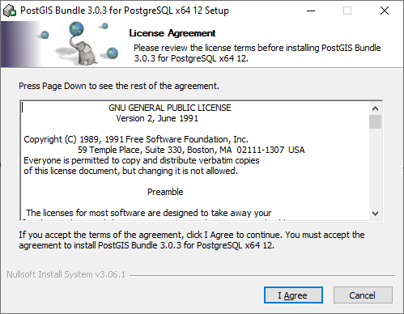
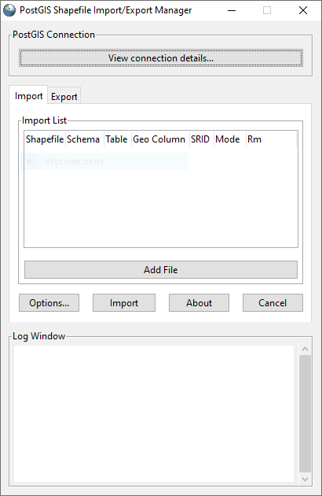

# Spatial Database/PostGIS

A spatial database is a database that is optimized for storing and querying data that represents objects defined in a geometric space. Most spatial databases allow the representation of simple geometric objects such as points, lines and polygons. Some spatial databases handle more complex structures such as 3D objects, topological coverages, linear networks, etc. 

The Open Geospatial Consortium (OGC) developed the Simple Features specification (first released in 1997) and sets standards for adding spatial functionality to database systems. The SQL/MM Spatial ISO/IEC standard is a part the SQL/MM multimedia standard and extends the Simple Features standard with data types that support circular interpolations.

## Spatial database managment systems
There are many database engines of this type. You can give examples as an example:

- GeoMesa 
- H2 (H2GIS) 
- IBM DB2 (IBM Informix Geodetic and Spatial)
- Microsoft SQL Server
- MonetDB/GIS 
- MySQL DBMS 
- Neo4j 
- Oracle Spatial
- PostgreSQL DBMS (PostGIS)

## PostGIS

### Example data set
To complete these activities, you will need to download a sample set that describes New York [(data)](http://s3.cleverelephant.ca/postgis-workshop-2018.zip).

This collection contains publicly available information on:
- blocks
- districts
- streets
- underground
- population data.

### Instalation PostGIS in PostgreSQL server

1. Open *PostgreSQL Application Stack Builder*.

2. The select server where you want to install PostGIS.
3. 


3. In section *Spatial Extensions* select PostGIS version to install.
4. 


4. Select a path to download installation file.

5. Before install PostGIS close PgAdmin.

6. Install PostGIS.
	1. Confirm licens:
	
	
	
	2. Install only PostGIS
	
	
### Create Spatial Database

1. Run PgAdmin

2. Create Database with settings:
	- Database: lab10_nyc
	- Owner: your admin user
	
3. Open *Query Tool* for  lab10_nyc

4. Add spatial extension to this database using the query:
```sql
CREATE EXTENSION postgis;
```
5. Confirm that PostGIS is installed by running a PostGIS function:

```sql
SELECT postgis_full_version();
```

Expected result:
```
POSTGIS="3.1.1 3.1.1" [EXTENSION] PGSQL="120" GEOS="3.9.1-CAPI-1.14.1" PROJ="7.1.1" LIBXML="2.9.9" LIBJSON="0.12" LIBPROTOBUF="1.2.1" WAGYU="0.5.0 (Internal)"
```

### Import spatial data to database

1. Open application *PostGIS Shapefile Import/Export Manager*



2. Inicializ conection to lab10_nyc using *View connection details...*
3. *Add File* from download [data](http://s3.cleverelephant.ca/postgis-workshop-2018.zip) with extension shp.
A shapefile (shp) is a simple, nontopological format for storing the geometric location and attribute information of geographic features. Geographic features in a shapefile can be represented by points, lines, or polygons (areas). The workspace containing shapefiles may also contain dBASE tables, which can store additional attributes that can be joined to a shapefile's features.
Mandatory files:

 - .shp—shape format; the feature geometry,
- .shx—shape index format; a positional index of the feature geometry
- .dbf—attribute format; columnar attributes for each shape, in dBase III 

Optional files include:

- .prj—projection format; the coordinate system and projection information, a plain text file describing the projection using well-known text format

4. Set data like in the image:


5. *Import* data to the database.
6. Check the result in PgAdmin


## View geometric data

### QGIS

QGIS is an Open Source Geographic Information System. The project was born in May 2002 and was established as a project on SourceForge in June the same year. We have worked hard to make GIS software (which is traditionally expensive proprietary software) available to anyone with access to a personal computer. QGIS currently runs on most Unix platforms, Windows, and macOS. QGIS is developed using the Qt toolkit (https://www.qt.io) and C++. This means that QGIS feels snappy and has a pleasing, easy-to-use graphical user interface (GUI).

QGIS aims to be a user-friendly GIS, providing common functions and features. The initial goal of the project was to provide a GIS data viewer. QGIS has reached the point in its evolution where it is being used for daily GIS data-viewing needs, for data capture, for advanced GIS analysis, and for presentations in the form of sophisticated maps, atlases and reports. QGIS supports a wealth of raster and vector data formats, with new format support easily added using the plugin architecture.

#### Connection with PostGIS database

1. Open QGIS.
2. In section *Explore* click second mouse botton on the PostGIS.
3. Add new connection setting form on the way on the image.
4. 


4. After connection open PostGIS database layer in QGIS.


##Exercises:

1. How many records are in the nyc_streets table?
2. How many streets in New York have names that start with ‘B’, 'Q' and 'M'?
3. What is the population of New York city?
4. What is the population of the Bronx, Manhattan and Queens?
5. How many "neighborhoods" are in each borough?
